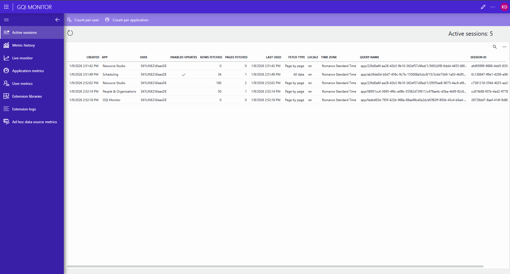
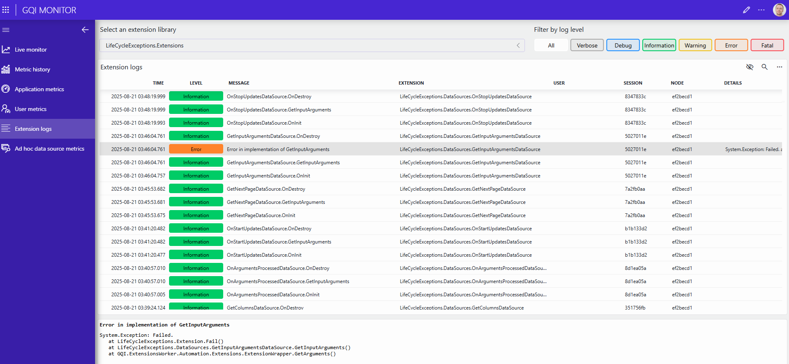
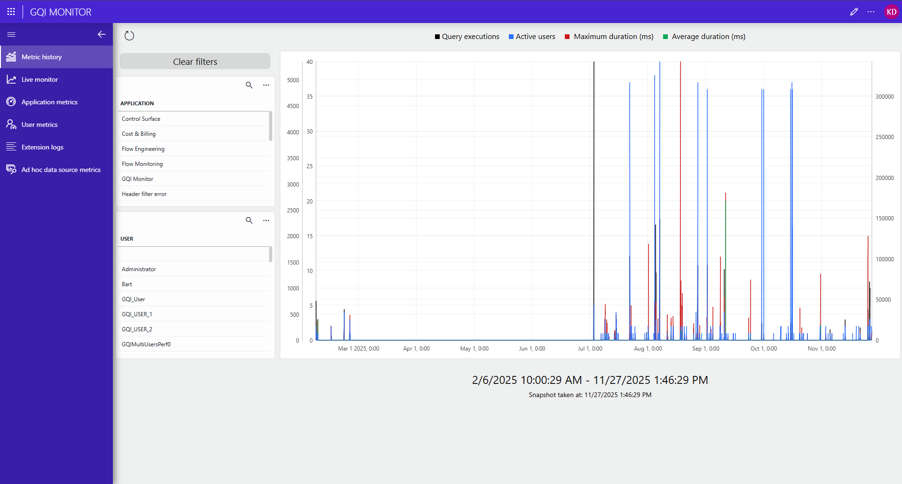

# GQI Monitor

## About

**GQI Monitor** empowers users with clear, real-time visibility into the health and performance of their GQI service. By surfacing actionable insights and key metrics, it helps you proactively address issues, optimize query performance, and maximize the value of your GQI environment.

## Key Features

- **View** active GQI sessions, including user and application details.
- **Monitor** real-time GQI service health and performance with live metrics.
- **Analyze** query performance, including total queries, active users, and query durations.
- **Track** usage of GQI extensions and ad hoc data sources.
- **Inspect** extension logs for troubleshooting and auditing.

## Use Cases

- Proactively detect and resolve GQI service bottlenecks before they impact users.
- Identify top users and applications driving query load.
- Audit extension library activity and troubleshoot issues using detailed logs.
- Monitor ad hoc data source performance to ensure optimal system operation.

## Prerequisites

- DataMiner Web version **10.5.0** or higher
- The **GQI DxM** should be enabled.

For specific features, additional prerequisites apply:

- **Active sessions**: DataMiner Web version **10.6.3** and the **Admin tools** permission.
- **Extension libraries**: DataMiner Web version **10.5.11** and the **Admin tools** permission.
- **Extension logs**: DataMiner Web version **10.5.9** and the **Admin tools** permission.
- **Ad hoc data source metrics**: DataMiner Web version **10.5.9** and the **Admin tools** permission.