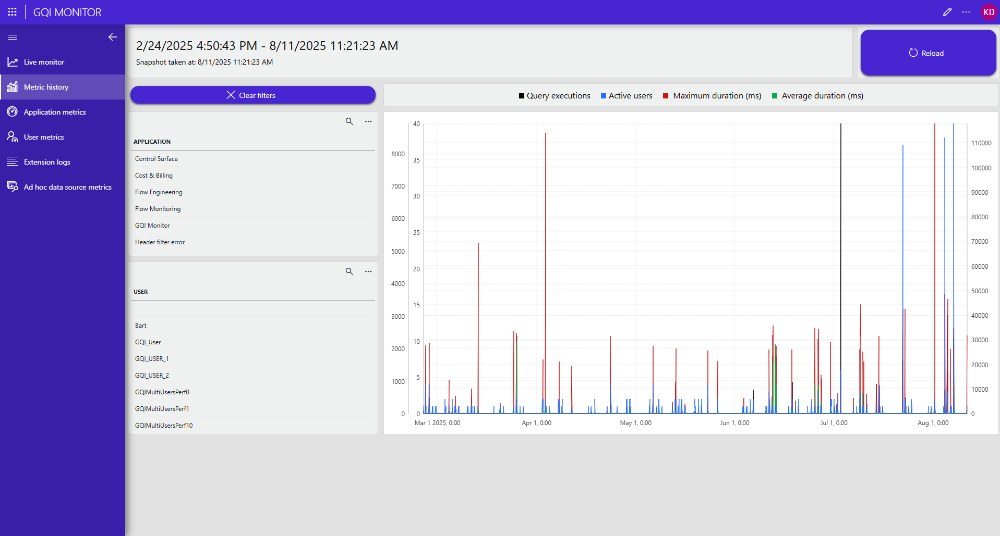

# GQI Monitor

A low-code app that allows you to monitor and analyze the performance of GQI queries on the system including:
- The number of queries executed
- The number of active users
- The maximum and average duration of queries

Currently, the app offers 4 distinct pages.
- Live monitor: metrics of the last 15 minutes updating every 10 seconds
- Metric history: overview of all metrics available on the system
- Application metrics: overview of the top 10 applications for each metric
- User metrics: overview of the top 10 users for each metric
- Extension logs: search and inspect log entries for each extension library

Prerequisites
- Web version 10.5.9 or higher

